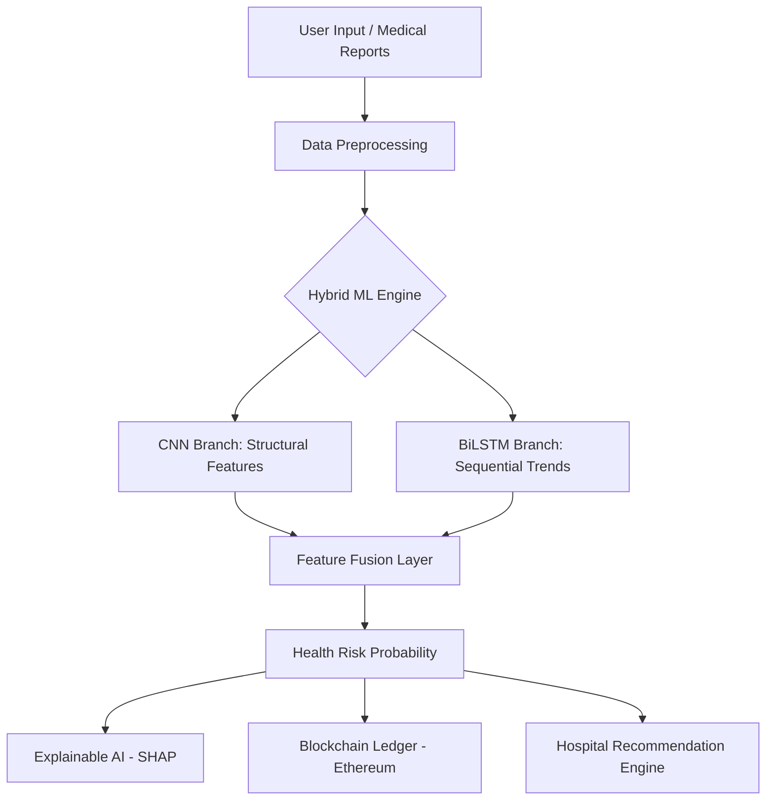

# 🧬 AuraHealth — AI-Powered Universal Wellness Infrastructure


> **Empowering Proactive Health Decisions through Hybrid Deep Learning and Blockchain Security.**

AuraHealth is a next-generation healthcare platform that bridges the gap between lifestyle data and early disease detection. By combining **CNN-BiLSTM architectures** for multi-modal analysis with **Ethereum-based smart contracts** for immutable health records, AuraHealth provides a secure, accurate, and scalable solution for preventive medicine.

---

## 🌟 Key Features

- **🧠 Multi-Modal Neural Engine**: Hybrid CNN-BiLSTM model that processes both static lifestyle metrics and sequential health trends for superior prediction accuracy.
- **👁️ Medical Vision**: Integrated ResNet-50 feature extraction to analyze medical images (X-rays, ECGs) alongside lifestyle data.
- **⛓️ Blockchain Integrity**: Every prediction is hashed and signed on the **Ethereum Sepolia Testnet**, ensuring patients own their data and it cannot be tampered with.
- **📊 XAI (Explainable AI)**: Uses **SHAP values** to visualize *why* the AI made a certain prediction, providing transparency to doctors and patients.
- **📍 Smart Triage**: Dynamic hospital recommendation engine that maps predicted risks to specialized nearby medical facilities based on real-time geographical data.

---

## 🏗️ Technical Architecture



### 🛠️ Tech Stack
- **Backend:** FastAPI (Python 3.10+), SQLAlchemy (PostgreSQL/SQLite)
- **Machine Learning:** PyTorch, Torchvision (ResNet-50), NumPy, Pandas
- **Blockchain:** Solidity (Smart Contracts), Web3.py, Ethereum (EVM)
- **Frontend:** Vanilla JS / React, TailwindCSS, Chart.js for visualization
- **DevOps:** Uvicorn, Python-dotenv, GIT

---

## 🌍 Real-World Impact

In the current healthcare landscape, **preventive action** is significantly more cost-effective and successful than **reactive treatment**. AuraHealth addresses three critical real-world challenges:

1.  **Early Detection of Silent Killers**: Conditions like Type 2 Diabetes and Hypertension often go unnoticed. AuraHealth uses subtle lifestyle patterns to flag high-risk individuals before symptoms become severe.
2.  **Data Security & Trust**: Traditional medical databases are centralized and vulnerable to breaches. By using blockchain technology, we ensure medical history is immutable and patient-controlled.
3.  **Explainability in Healthcare**: Black-box AI is dangerous in medicine. Our implementation of Explainable AI (XAI) ensures that clinicians can verify the logic behind every risk score.

---

## 🚀 Getting Started

### Prerequisites
- Python 3.10+
- Node.js (for Smart Contract deployment)
- Ethereum Wallet (MetaMask) for blockchain features

### Installation & Setup

1. **Clone the Repository**
   ```bash
   git clone https://github.com/santhoshkumar7507/Disease-Prediction-Using-ML.git
   cd Disease-Prediction-Using-ML/aurahealth
   ```

2. **Backend Configuration**
   ```bash
   cd backend
   python -m venv venv
   source venv/bin/activate  # venv\Scripts\activate on Windows
   pip install -r requirements.txt
   ```

3. **Environment Setup**
   Create a `.env` file in the `backend/` directory:
   ```env
   DATABASE_URL=sqlite:///./aurahealth.db
   JWT_SECRET=your_secret_key
   BLOCKCHAIN_RPC=https://sepolia.infura.io/v3/YOUR_INFURA_KEY
   CONTRACT_ADDRESS=0x...
   ```

4. **Launch the Servers**
   - **Backend**: `uvicorn main:app --reload --port 8000`
   - **Frontend**: `cd ../frontend && python -m http.server 5500`

---

## ❓ Why this Repository?

The healthcare industry is currently undergoing a digital transformation where data trust and predictive accuracy are paramount. This repository serves as a **blueprint for decentralized medical intelligence**.

- **Innovation at the Core**: Unlike standard prediction models, this repo implements a **fused neural architecture**, merging CNNs for static risk factors and LSTMs for longitudinal health patterns.
- **Solving the 'Trust' Problem**: Healthcare data is often siloed. By integrating an **Ethereum-based ledger**, we demonstrate a real-world application of how patients can hold cryptographically verifiable proof of their medical history.
- **Bridges AI and Action**: This isn't just a research paper; it's a functional prototype that connects **Explainable AI (XAI)** diagnostics directly to **Smart Hospital Triage**, creating a closed-loop system from prediction to care.

---

## 📜 License
Published under the MIT License. Developed for the Final Year Project — Healthcare Innovation.

---
*Created with ❤️ by the AuraHealth Team.*
