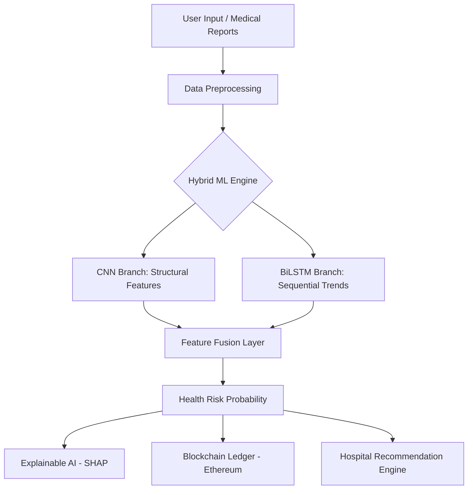

# 🧬 AuraHealth — AI-Powered Universal Wellness Infrastructure

<div align="center">


[](https://fastapi.tiangolo.com/)
[](https://developer.mozilla.org/en-US/docs/Web/JavaScript)
[](https://ethereum.org/)
[](https://opensource.org/licenses/MIT)

**Empowering Proactive Health Decisions through Hybrid Deep Learning and Blockchain Security.**

</div>

---

## 🌟 Vision
**AuraHealth** is a next-generation healthcare platform that bridges the gap between lifestyle data and early disease detection. By combining **CNN-BiLSTM architectures** for multi-modal analysis with **Ethereum-based smart contracts** for immutable health records, AuraHealth provides a secure, accurate, and scalable solution for preventive medicine.

## 🚀 Key Features

- **🧠 Multi-Modal Neural Engine**: Hybrid CNN-BiLSTM model that processes both static lifestyle metrics and sequential health trends for superior prediction accuracy.
- **📊 Universal Wellness Intelligence**: Dynamic data visualization using Chart.js, providing intuitive Bar and Radar charts for health tracking.
- **⛓️ Blockchain Integrity**: Every prediction is hashed and signed on the **Ethereum Sepolia Testnet**, ensuring patients own their data and it remains tamper-proof.
- **👁️ Medical Vision**: Integrated ResNet-50 feature extraction to analyze medical images (X-rays, ECGs) alongside lifestyle data.
- **📍 Smart Triage**: Dynamic hospital recommendation engine that maps predicted risks to specialized nearby medical facilities.
- **🎨 Premium UI/UX**: State-of-the-art glassmorphism design with ambient animations and high-fidelity interactions.

---

## 🏗️ Technical Architecture



### 🛠️ Tech Stack
- **Backend:** FastAPI (Python 3.10+), SQLAlchemy (PostgreSQL/SQLite)
- **Machine Learning:** PyTorch, Torchvision (ResNet-50), NumPy, Pandas
- **Blockchain:** Solidity (Smart Contracts), Web3.py, Ethereum (Sepolia Testnet)
- **Frontend:** Vanilla JavaScript, Chart.js, CSS Glassmorphism
- **DevOps:** Uvicorn, Python-dotenv, GIT

---

## 🌍 Real-World Impact

AuraHealth addresses three critical challenges in modern healthcare:

1.  **Early Detection**: Identifies "silent killers" like Type 2 Diabetes and Hypertension before they become severe.
2.  **Data Sovereignty**: Uses blockchain to ensure medical history is immutable and patient-controlled.
3.  **Actionable Intelligence**: Bridges the gap between raw data and medical action through hospital triage and personalized care plans.

---

## 🚀 Getting Started

### 1. Clone the Repository
```bash
git clone https://github.com/santhoshkumar7507/Healthcare-Application.git
cd Healthcare-Application
```

### 2. Backend Setup
```bash
cd backend
python -m venv venv
source venv/bin/activate  # Windows: venv\Scripts\activate
pip install -r requirements.txt
uvicorn main:app --reload --port 8000
```

### 3. Frontend Setup
```bash
cd ../frontend
python -m http.server 5500
```
Visit `http://localhost:5500` to access the application.

---

## 📜 License
Published under the MIT License. Developed for the Final Year Project — Healthcare Innovation.

---
*Created with ❤️ by the AuraHealth Team.*
